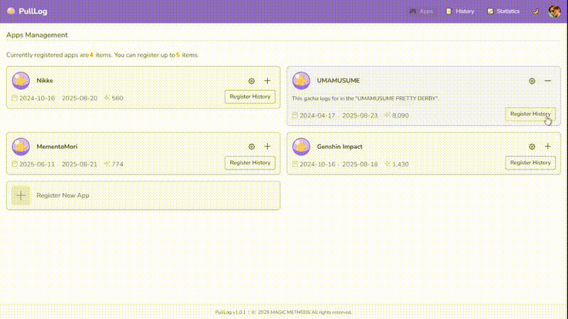
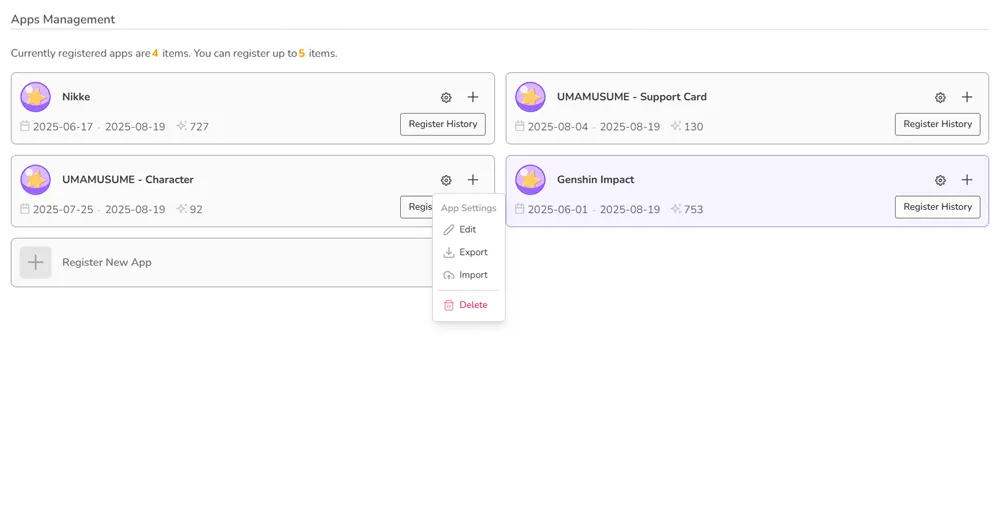
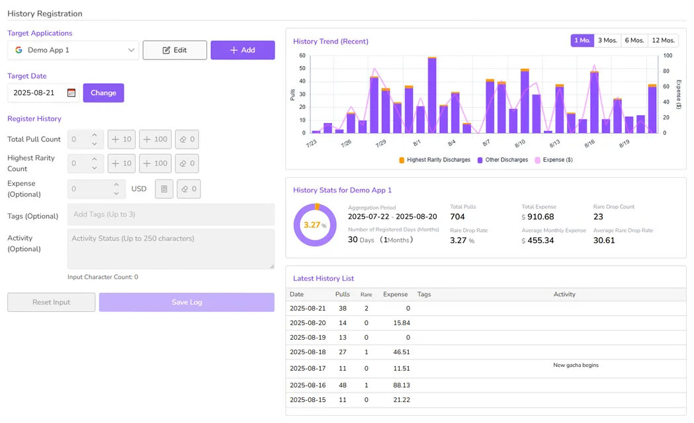
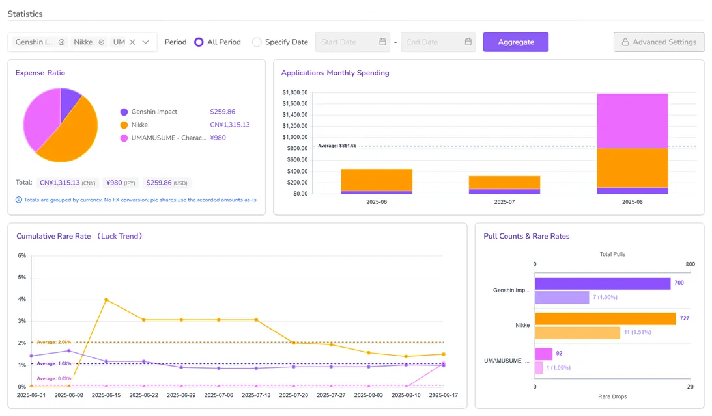

#  PullLog ドキュメント（公開版）

> このリポジトリは PullLog の**公開向け技術ドキュメント**を管理します。  
> **ソースコードは非公開**です。Issue と Discussion は歓迎します。

> English version: [README.md](README.md)

> 用語方針: PullLog 全体は workspace、frontend、backend、contract、pulllog-docs などの各トップレベルディレクトリは subproject と呼びます。正式な定義は docs/workspace-terminology.md を参照してください。VS Code や pnpm の機能名に言及する場合は、それぞれの公式用語を優先します。

## PullLog とは

PullLog は、複数タイトルのガチャ履歴、レア排出率、課金額などを**記録・分析する Web アプリケーション**です。

- Frontend: Nuxt 3（SSR）+ API プロキシ
- Backend: Laravel 12 + PostgreSQL 14
- Infra: Cloudflare Workers + VPS

|  |
|:---:|
| デモ動画 |

|  |  |  |
|:---:|:---:|:---:|
| アプリ管理 | 履歴管理 | 統計表示 |

## ドキュメント一覧

- 用語方針: [docs/workspace-terminology.md](docs/workspace-terminology.md) / [日本語版](docs/workspace-terminology-ja.md)
- ドキュメントガバナンス: [docs/document-governance.md](docs/document-governance.md) / [日本語版](docs/document-governance-ja.md)
- アーキテクチャ: [docs/architecture.md](docs/architecture.md) / [日本語版](docs/architecture-ja.md)
- Frontend: [docs/frontend.md](docs/frontend.md) / [日本語版](docs/frontend-ja.md)
- Backend: [docs/backend.md](docs/backend.md) / [日本語版](docs/backend-ja.md)
- API 概要: [docs/api-overview.md](docs/api-overview.md) / [日本語版](docs/api-overview-ja.md)
- 運用概要（公開情報のみ）: [docs/ops.md](docs/ops.md) / [日本語版](docs/ops-ja.md)
- 利用規約 / プライバシー: [public/terms.md](public/terms.md), [public/privacy.md](public/privacy.md)
- ロードマップ: [ROADMAP.md](ROADMAP.md)
- 変更履歴: [CHANGELOG.md](CHANGELOG.md)

> 注意: 認証情報、内部エンドポイント、秘密情報は公開しません。

## フィードバック

- バグ報告: GitHub [Issues](https://github.com/magicmethods/pulllog-docs/issues)
- 機能要望: GitHub [Issues](https://github.com/magicmethods/pulllog-docs/issues) / [Discussions](https://github.com/magicmethods/pulllog-docs/discussions)
- セキュリティ報告: [SECURITY.md](SECURITY.md) を参照してください

## ライセンス

特記がない限り、このドキュメントは [Creative Commons Attribution-NonCommercial 4.0 International License (CC BY-NC 4.0)](https://creativecommons.org/licenses/by-nc/4.0/) の下で公開されます。

