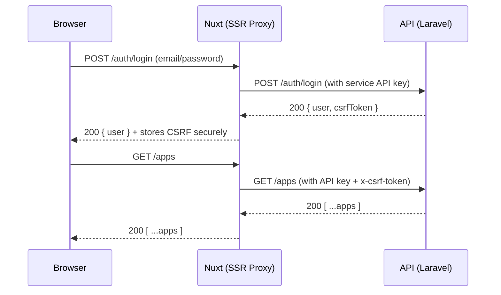

# PullLog API — Overview

This document provides a **high‑level overview** of the PullLog backend API.  
It explains versioning, authentication, key resources, and typical client flows used by the official frontend.

> **Note**  
> The canonical, machine‑readable specification is maintained separately.  
> This overview may omit some fields or minor endpoints and focuses on the primary flows.

---

## Base URLs & Versioning

- **Production**: `https://api.pulllog.net/api/v1`
- **Local (mock)**: `http://localhost:3030/beta`
- **Local (stable)**: `http://localhost:3030/api/v1`

API is **versioned** under `/api/{version}`. Breaking changes will be introduced in a new version path (e.g., `/api/v2`).

---

## Authentication & Session Model

PullLog uses a **two‑layer** model:

1. **Service‑to‑service API key**  
   - Managed by the **server‑side API proxy** in the official Nuxt (SSR) frontend.  
   - Clients **should not** call the backend directly from browsers. Use the official frontend.

2. **Per‑user CSRF/session token**  
   - After login, the backend issues a CSRF token.  
   - Authenticated API calls require the header:  
     - `x-csrf-token: <token>`

Additional notes:
- Cookies/Remember tokens may be used by `/auth/autologin`.  
- OAuth (Google) is supported via a token exchange endpoint.  
- Some public read endpoints (e.g., currencies) require only the service API key (proxied), not CSRF.

---

## Content Types

- Request/Response: `application/json` (unless otherwise noted)  
- File upload (logs import, avatar): `multipart/form-data`

---

## Resource Map (Primary)

| Area     | Method & Path                              | Purpose                                           | Auth (proxy/API key) | CSRF |
|----------|--------------------------------------------|---------------------------------------------------|----------------------|------|
| Auth     | `POST /auth/login`                         | Email/password login → user + CSRF                | required             | no   |
| Auth     | `POST /auth/autologin`                     | Cookie‑based auto login                           | required             | no   |
| Auth     | `POST /auth/register`                      | Create account (email verification flow)          | required             | no   |
| Auth     | `POST /auth/verify`                        | Verify email / token                              | required             | no   |
| Auth     | `POST /auth/password`                      | Request password reset mail                       | required             | no   |
| Auth     | `PUT  /auth/password`                      | Confirm password reset                            | required             | no   |
| Auth     | `POST /auth/csrf/refresh`                  | Refresh CSRF token                                | required             | no   |
| Auth     | `POST /auth/google/exchange`               | OAuth (Google) token exchange                     | required             | no   |
| Auth     | `POST /auth/logout`                        | Logout                                            | required             | yes  |
| Apps     | `GET  /apps`                               | List my apps                                      | required             | yes  |
| Apps     | `POST /apps`                               | Create app                                        | required             | yes  |
| Apps     | `GET  /apps/{appId}`                       | Get app detail                                    | required             | yes  |
| Apps     | `PUT  /apps/{appId}`                       | Update app                                        | required             | yes  |
| Apps     | `DELETE /apps/{appId}`                     | Delete app                                        | required             | yes  |
| Logs     | `GET  /logs/{appId}`                       | List daily logs (range, limit/offset)             | required             | yes  |
| Logs     | `GET  /logs/daily/{appId}/{date}`          | Get a daily log                                   | required             | yes  |
| Logs     | `POST /logs/daily/{appId}/{date}`          | Create a daily log                                | required             | yes  |
| Logs     | `PUT  /logs/daily/{appId}/{date}`          | Update a daily log                                | required             | yes  |
| Logs     | `DELETE /logs/daily/{appId}/{date}`        | Delete a daily log                                | required             | yes  |
| Logs     | `POST /logs/import/{appId}?mode=…`         | Bulk import logs (JSON/CSV)                       | required             | yes  |
| Stats    | `GET  /stats/{appId}?start=…&end=…`        | Aggregated stats for an app                       | required             | yes  |
| User     | `GET  /user`                               | Get my profile                                    | required             | yes  |
| User     | `PUT  /user/update`                        | Update profile (JSON or multipart)                | required             | yes  |
| User     | `DELETE /user`                             | Delete account                                    | required             | yes  |
| Currency | `GET  /currencies`                         | Currency master list                              | required             | no   |
| Utility  | `GET  /dummy`                              | Health check (JSON response)                      | no (open)            | no   |

> **Note**  
> Endpoint naming may slightly differ in the legacy frontend helper; the table reflects the current backend routes.

---

## Typical Flows

### 1) Login → Authenticated Requests



### 2) Daily Log CRUD

- Create: `POST /logs/daily/{appId}/{date}`
- Update: `PUT /logs/daily/{appId}/{date}`
- Delete: `DELETE /logs/daily/{appId}/{date}`
- Get: `GET /logs/daily/{appId}/{date}`

All require CSRF and are scoped to the authenticated user.

### 3) Bulk Import

```pgsql
POST /logs/import/{appId}?mode=overwrite|merge
Content-Type: multipart/form-data
file: <JSON or CSV>
```

Useful for migrating spreadsheets or consolidating logs.

---

## Request Parameters (Selected)

### Logs listing
```pgsql
GET /logs/{appId}?from=YYYY-MM-DD&to=YYYY-MM-DD&limit=N&offset=M
```

- `from`, `to`: inclusive date range
- `limit`, `offset`: pagination window

### Stats
```pgsql
GET /stats/{appId}?start=YYYY-MM-DD&end=YYYY-MM-DD
```

Returns totals/averages (pulls, rare rates, expense, etc.) for the range.

---

## Data Models (Selected)

> Field sets below are indicative. See the full spec for exhaustive definitions.

### `AppData`

- `appId` (ULID), `name`, `description?`, `url?`
- Date boundary behavior: `date_update_time`, `sync_update_time`
- Currency: `currency_code` (matches app’s currency)
- Optional definitions: `rarity_defs[]`, `marker_defs[]`, `task_defs[]`

### `DateLog`

- `appId`, `date` (YYYY-MM-DD)
- `total_pulls`, `discharge_items`
- `expense` (integer, currency minor unit)
- `drop_details[]` (rarity/name/marker)
- `tags[]`, `free_text`, `images[]`, `tasks[]`
- `last_updated`

### `StatsData`

- Range: `startDate`, `endDate`
- Aggregates: `totalPulls`, `rareDropCount`, `rareDropRate`, `totalExpense`, etc.

---

## Error Handling

- Standard HTTP status codes (`400`, `401`, `404`, `409`, `500`, …).
- Body typically includes a `state` or `success` flag and a human-readable `message`.
- Validation errors return `400` with details; auth errors return `401`.

---

## Security Notes

- **Do not** embed the service API key in browsers or public clients.  
  Use the official frontend, which proxies and signs requests server-side.
- Authenticated calls require a **valid CSRF token** via `x-csrf-token`.
- Uploaded files are validated and may be sanitized (e.g., images).

---

## Compatibility & Deprecation

- Minor response fields may evolve without breaking semantics.
- Breaking changes will be released under a new version path (e.g., `/api/v2`).
- Deprecated endpoints remain available for a transition period where feasible.

---

## See Also

Nothing

---