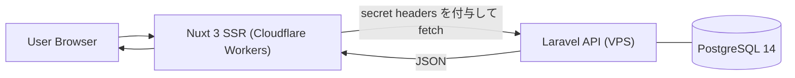

# アーキテクチャ

PullLog は frontend と backend を分離した構成を採用しています。  
frontend は Nuxt 3 SSR、backend は Laravel 12 API を担います。  
オリジンをまたぐセッション共有には依存せず、SSR 側の API プロキシが API キーとトークンを付与して認証リクエストを中継します。

## 主な設計判断

- SSR API Proxy: 秘密情報をブラウザへ出さず、認証ヘッダをサーバー側で付与します
- CORS-friendly: クロスサイト Cookie ではなく、ステートレスな API キーとトークンを前提にします
- Cloudflare Workers: SSR とエッジ配信の運用コストを抑えます
- Manifest-driven E2E: 重要なユーザーフローは case manifest、規定デバイスマトリクス、テンプレートベース報告で検証します

## 公開 E2E アーキテクチャ概要

PullLog は、ユーザーから見える重要フローを対象に、workspace 横断の Playwright E2E アプローチを採用しています。

### 主な特性

- manifest-driven なケース管理
- PC / tablet / smartphone を対象にした規定デフォルトマトリクス
- Markdown と PDF の共有 evidence テンプレート
- 決定論的な report と evidence の保存パス
- 同じ case を複数 project で実行した場合の集約レポート

### 規定デフォルトマトリクス

- `chromium`: PC
- `ipad-pro-11`: tablet
- `iphone-14`: smartphone

### レポートモデル

- 各実行で Markdown レポートを生成します
- 成功した実行は PDF evidence としてアーカイブできます
- 同じ case を複数 project で実行した場合、1 件のケースレポートへ結果を集約します
- PDF evidence では PC / Tablet / Smartphone の比較表と詳細セクションを併記できます