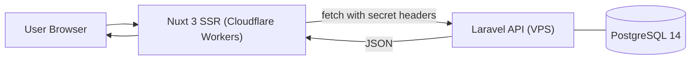

# Architecture

PullLog is split across **separate domains** for frontend (Nuxt 3 SSR) and backend (Laravel 12 API).  
Sessions are **not** cookie-based across origins; requests are authenticated via **API key & tokens** injected by the SSR **API proxy**.

## Key Decisions
- **SSR API Proxy:** Hide secrets and add auth headers server-side.
- **CORS-friendly:** No cross-site cookies; stateless API tokens instead.
- **Cloudflare Workers:** Cost-effective SSR & edge caching.
- **Manifest-driven E2E:** Critical end-to-end user flows are validated through case manifests, a standard multi-device matrix, and template-based reporting.

## Public E2E Architecture Summary

PullLog uses a repository-wide Playwright E2E approach for critical user-observable flows.

### Core traits
- manifest-driven case management
- standard default matrix for PC / tablet / smartphone coverage
- shared Markdown and PDF evidence templates
- deterministic report and evidence paths
- aggregated reporting when the same case runs across multiple projects

### Standard default matrix
- `chromium` for PC
- `ipad-pro-11` for tablet
- `iphone-14` for smartphone

### Reporting model
- Each execution produces a Markdown report.
- Successful runs may be archived as PDF evidence.
- When multiple projects execute the same case, the report is aggregated into one case report with per-project results.
- PDF evidence may include a PC / Tablet / Smartphone comparison table in addition to detailed sections.

