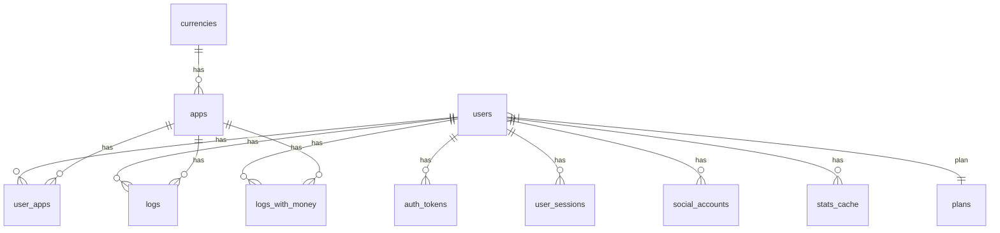

# PullLog Backend Documentation

The PullLog backend is the **API server** of the PullLog web application, enabling secure communication between the frontend and the PostgreSQL database.  
It is implemented with Laravel and provides RESTful endpoints returning JSON responses that conform to OpenAPI schema definitions.  
For local development and prototyping, a lightweight mock environment based on [MockAPI-PHP](https://github.com/ka215/MockAPI-PHP) is also provided.

---

## Key Features

- API endpoints returning JSON responses
- Token-based authentication per request
- Database persistence and validation
- No UI layer (backend is API-only)
- Responses conform to OpenAPI schema specifications
- Mock environment for rapid prototyping

---

## Technology Stack

- **Language**: PHP 8.3 (dev environment: v8.4.2)
- **Framework**: Laravel 12.20.0
- **Database**: PostgreSQL 14.13 (dev environment: v17.4)
- **Mock Environment**: MockAPI-PHP v1.3.1
- **Image Processing**: Intervention Image v3.11.4 (driver: GD)
- **Mail (dev use)**: Mailtrap
- ~~OpenAPI generator: openapi-generator-cli v7.14.0 (deprecated in favor of contract-first docs)~~

---

## Database Schema

### Tables

| Table            | Purpose                     | Main Columns (simplified)                      |
|------------------|-----------------------------|------------------------------------------------|
| `plans`          | Subscription plan management| id (PK), name, max_apps, …                     |
| `users`          | User accounts               | id (PK), email (UQ), plan_id (FK), roles, …    |
| `currencies`     | Currency master             | code (PK), name, minor_unit, rounding, …       |
| `apps`           | Applications                | id (PK), app_key (UQ), currency_code (FK), …   |
| `user_apps`      | User–App pivot              | id (PK), user_id (FK), app_id (FK), [UQ], …   |
| `auth_tokens`    | Auth token management       | id (PK), user_id (FK), token (UQ), type, …     |
| `user_sessions`  | CSRF session tokens         | csrf_token (PK), user_id (FK), email, …        |
| `stats_cache`    | Cached statistics           | cache_key (PK), user_id (FK), value, …         |
| `logs`           | Daily logs (partitioned)    | [user_id, id] (PK), user_id (FK), app_id (FK), … |
| `logs_with_money`| Read-only view for joins    | Derived: logs JOIN apps JOIN currencies         |

> **Notes**:  
> - `logs` is **partitioned by `user_id` (HASH)** into 10 sub-tables `logs_p0`–`logs_p9`.  
> - Application access always targets the parent table `logs`.  
> - Database migrations are handled by Laravel’s `artisan migrate`, except for the partitioned logs table which uses a dedicated DDL.  

---

## ER Diagrams

### Summary ER Diagram


### Full ER Diagram

```mermaid
%% Mermaid ER (PostgreSQL oriented)
erDiagram
    %% =======================
    %% Users
    %% =======================
    users ||--o{ user_apps: "has"
    users ||--o{ logs: "has"
    users ||--o{ auth_tokens: "has"
    users ||--o{ user_sessions: "has"
    users ||--o{ social_accounts: "has"
    users ||--o{ stats_cache: "has"
    users }|--|| plans: "belongs to"

    users {
        SERIAL       id
        VARCHAR      email
        VARCHAR      password
        VARCHAR      name
        VARCHAR      avatar_url
        VARCHAR[]    roles
        INTEGER      plan_id
        TIMESTAMPTZ  plan_expiration
        VARCHAR      language
        theme        theme
        VARCHAR      home_page
        TIMESTAMPTZ  last_login
        VARCHAR      last_login_ip
        VARCHAR      last_login_ua
        BOOLEAN      is_deleted
        BOOLEAN      is_verified
        VARCHAR      remember_token
        INTEGER[]    unread_notices
        TIMESTAMPTZ  email_verified_at
        TIMESTAMPTZ  created_at
        TIMESTAMPTZ  updated_at
    }

    %% =======================
    %% Plans
    %% =======================
    plans ||--o{ users: "has"
    plans {
        SERIAL       id
        VARCHAR      name
        TEXT         description
        INTEGER      max_apps
        INTEGER      max_app_name_length
        INTEGER      max_app_desc_length
        INTEGER      max_log_tags
        INTEGER      max_log_tag_length
        INTEGER      max_log_text_length
        INTEGER      max_logs_per_app
        INTEGER      max_storage_mb
        INTEGER      price_per_month
        BOOLEAN      is_active
        TIMESTAMPTZ  created_at
        TIMESTAMPTZ  updated_at
    }

    %% =======================
    %% Currencies
    %% =======================
    currencies ||--o{ apps: "has"
    currencies {
        CHAR(3)      code
        VARCHAR      name
        VARCHAR      symbol
        VARCHAR      symbol_native
        SMALLINT     minor_unit
        NUMERIC      rounding
        VARCHAR      name_plural
        TIMESTAMPTZ  created_at
        TIMESTAMPTZ  updated_at
    }

    %% =======================
    %% Apps
    %% =======================
    apps ||--o{ user_apps: "has"
    apps ||--o{ logs: "has"
    apps {
        SERIAL       id
        VARCHAR(64)  app_key
        VARCHAR(128) name
        VARCHAR(255) url
        TEXT         description
        CHAR(3)      currency_code  "FK -> currencies.code"
        VARCHAR(5)   date_update_time
        BOOLEAN      sync_update_time
        BOOLEAN      pity_system
        INTEGER      guarantee_count
        JSONB        rarity_defs
        JSONB        marker_defs
        JSONB        task_defs
        TIMESTAMPTZ  created_at
        TIMESTAMPTZ  updated_at
    }

    %% =======================
    %% Pivot: user_apps
    %% =======================
    user_apps {
        SERIAL       id
        INTEGER      user_id  "FK -> users.id"
        INTEGER      app_id   "FK -> apps.id"
        TIMESTAMPTZ  created_at
        TIMESTAMPTZ  updated_at
        %% UNIQUE (user_id, app_id) 推奨
    }

    %% =======================
    %% Logs (hash partitioned by user_id)
    %% =======================
    logs {
        BIGSERIAL    id
        INTEGER      user_id  "FK -> users.id"
        INTEGER      app_id   "FK -> apps.id"
        DATE         log_date
        INTEGER      total_pulls
        INTEGER      discharge_items
        BIGINT       expense_amount   "minor units (non-negative)"
        JSONB        drop_details
        JSONB        tags
        TEXT         free_text
        JSONB        images
        JSONB        tasks
        TIMESTAMPTZ  created_at
        TIMESTAMPTZ  updated_at
        %% PRIMARY KEY (user_id, id)
        %% UNIQUE (user_id, app_id, log_date)
        %% PARTITION BY HASH (user_id)
    }

    %% =======================
    %% View: logs_with_money (read-only)
    %% =======================
    users ||--o{ logs_with_money: "has"
    apps  ||--o{ logs_with_money: "has"
    logs_with_money {
        BIGINT       id             "from logs.id"
        INTEGER      user_id
        INTEGER      app_id
        DATE         log_date
        INTEGER      total_pulls
        INTEGER      discharge_items
        BIGINT       expense_amount
        CHAR(3)      currency_code
        SMALLINT     minor_unit
        NUMERIC      expense_decimal
        JSONB        drop_details
        JSONB        tags
        TEXT         free_text
        JSONB        images
        JSONB        tasks
        TIMESTAMPTZ  created_at
        TIMESTAMPTZ  updated_at
        %% VIEW: logs JOIN apps JOIN currencies
    }

    %% =======================
    %% Auth tokens
    %% =======================
    auth_tokens {
        SERIAL       id
        INTEGER      user_id     "FK -> users.id"
        VARCHAR      token
        token_type   type
        VARCHAR      code
        BOOLEAN      is_used
        INTEGER      failed_attempts
        VARCHAR      ip
        VARCHAR      ua
        TIMESTAMPTZ  expires_at
        TIMESTAMPTZ  created_at
    }

    %% =======================
    %% User sessions
    %% =======================
    user_sessions {
        VARCHAR      csrf_token   "PK"
        INTEGER      user_id      "FK -> users.id"
        VARCHAR      email
        TIMESTAMPTZ  created_at
        TIMESTAMPTZ  expires_at
    }

    %% =======================
    %% Social accounts
    %% =======================
    social_accounts {
        SERIAL       id
        INTEGER      user_id      "FK -> users.id"
        VARCHAR      provider
        VARCHAR      provider_user_id
        VARCHAR      provider_email
        VARCHAR      avatar_url
        TEXT         access_token     "encrypted cast"
        TEXT         refresh_token    "encrypted cast"
        TIMESTAMPTZ  token_expires_at
        TIMESTAMPTZ  created_at
        TIMESTAMPTZ  updated_at
    }

    %% =======================
    %% Stats cache (per user or global when user_id NULL)
    %% =======================
    stats_cache {
        INTEGER      user_id      "FK -> users.id (nullable)"
        VARCHAR      cache_key    "PK"
        JSONB        value
        TIMESTAMPTZ  created_at
        TIMESTAMPTZ  updated_at
    }
```


---

## Deployment

### Steps (Production Example)

1. Clone repository  
    ```bash
    git clone https://github.com/magicmethods/pulllog-backend.git
    cd pulllog-backend
    ```
2. Configure environment  
    - Copy `.env.example` to `.env`
    - Set DB credentials, APP_KEY, cache/mail configs, etc.
    - Generate key:  
      ```bash
      php artisan key:generate
      ```
    - Generate API key (via Tinker):  
3. Install dependencies  
    ```bash
    composer install --no-dev --optimize-autoloader
    ```
4. Set permissions  
    ```bash
    chown -R www-data:www-data storage bootstrap/cache
    chmod -R 775 storage bootstrap/cache
    ```
5. Run migrations  
    ```bash
    php artisan migrate --seed
    psql -U <user> -d <dbname> -f create_logs_tables.sql
    ```
6. Optimize cache  
    ```bash
    php artisan config:cache
    php artisan route:cache
    php artisan view:cache
    php artisan event:cache
    ```
7. Configure web server (Nginx/Apache)  
    Example: Nginx root → `/var/www/pulllog-backend/public`
8. Verify
    Access: `https://api.pulllog.net/api/v1/dummy`

---

## Mock Environment
A lightweight mock system is available in the beta/ directory:  
```bash
composer install
php ./start_server.php
```
Mock API runs at `http://localhost:3030/mock` and can be used by pointing the frontend’s `.env.local`:  
```env
API_BASE_URL=http://localhost:3030/mock
```
Notes: email confirmation and certain auth flows are skipped in mock mode.

---

## License
All rights reserved by **MAGIC METHODS**.

---

## Contribution
Contributions via Pull Requests and Issues are welcome.  
Discussion of designs and specifications is encouraged in Issues/Discussions.

---

## Related Links

- [PullLog Frontend Documentation](./frontend.md)
- [PullLog API Specification](../docs/api_overview.md)
- [Terms of Service](../public/docs/terms_en.md)  
- [Privacy Policy](../public/docs/privacy_policy_en.md)

---
