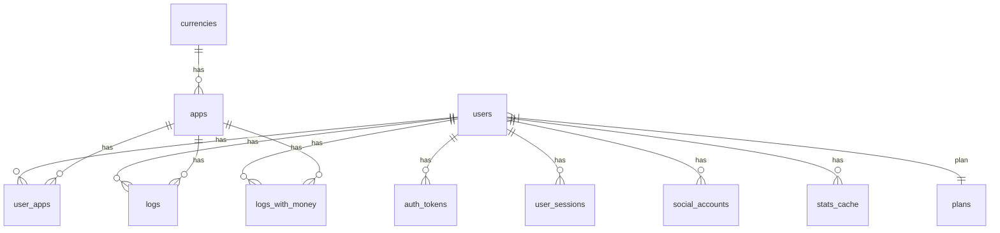

# PullLog Backend ドキュメント（日本語版）

## 概要

PullLog Backend は、個人のガチャ履歴を記録・管理する Web アプリ「PullLog」のバックエンド部分です。  
フロントエンドとデータベースの間で API を通じたデータ中継を担い、リクエストに応じて JSON レスポンスを返します。  

- バックエンドは **Laravel + PostgreSQL** を基盤技術としています  
- 初期開発や検証のためのモック環境として [MockAPI-PHP](https://github.com/ka215/MockAPI-PHP) を利用しています  
- 認証・セッション管理・統計処理・画像処理などを含みます  

---

## 主な機能

- RESTful API 形式で JSON レスポンスを返却  
- ユーザー認証・トークン管理・CSRF セッションの検証  
- ユーザーごとの履歴データの保存・集計  
- 通貨単位・小数桁数に応じた課金データ処理  
- 統計キャッシュによる効率的な分析処理  

---

## 技術スタック

- **言語**: PHP v8.3（開発環境 v8.4.2）  
- **フレームワーク**: Laravel v12.20.0  
- **データベース**: PostgreSQL v14.13（開発環境 v17.4）  
- **モック環境**: MockAPI-PHP v1.3.1  
- **画像処理**: Intervention Image v3.11.4  
- **開発用メール送信**: mailtrap  

---

## データベース構成

主要テーブル（マイグレーション順）:

| テーブル名         | 用途                          | 主なカラム例                                   |
|--------------------|-------------------------------|-----------------------------------------------|
| `plans`            | 契約プラン管理                | id, name, max_apps, ...                       |
| `users`            | ユーザー管理                  | id, email, roles, plan_id, ...                |
| `currencies`       | 通貨マスタ                    | code, name, minor_unit, rounding, ...         |
| `apps`             | アプリ管理                    | id, app_key, currency_code, ...               |
| `user_apps`        | ユーザー・アプリ Pivot         | id, user_id, app_id, ...                      |
| `auth_tokens`      | 認証トークン管理              | id, user_id, token, type, ...                 |
| `user_sessions`    | CSRFトークンセッション管理     | csrf_token, user_id, email, ...               |
| `stats_cache`      | 統計キャッシュ管理            | cache_key, user_id, value, ...                |
| `logs`             | ガチャ履歴管理（パーティション化） | (user_id, id), log_date, expense_amount, ...  |
| `logs_with_money`  | 履歴ビュー（通貨換算済）      | logs JOIN apps JOIN currencies                |

- `logs` テーブルは `user_id` で **ハッシュパーティション化** され、`logs_p0` ～ `logs_p9` を持ちます  
- Laravel/Eloquent からは代表テーブル `logs` を通じて一元的にアクセスします  
- スキーマ定義は [pulllog-ddl.sql](https://github.com/magicmethods/pulllog-backend/blob/main/pulllog-ddl.sql) を参照  

---

## ER図

### サマリー

### フル仕様

```mermaid
%% Mermaid ER (PostgreSQL oriented)
erDiagram
    %% =======================
    %% Users
    %% =======================
    users ||--o{ user_apps: "has"
    users ||--o{ logs: "has"
    users ||--o{ auth_tokens: "has"
    users ||--o{ user_sessions: "has"
    users ||--o{ social_accounts: "has"
    users ||--o{ stats_cache: "has"
    users }|--|| plans: "belongs to"

    users {
        SERIAL       id
        VARCHAR      email
        VARCHAR      password
        VARCHAR      name
        VARCHAR      avatar_url
        VARCHAR[]    roles
        INTEGER      plan_id
        TIMESTAMPTZ  plan_expiration
        VARCHAR      language
        theme        theme
        VARCHAR      home_page
        TIMESTAMPTZ  last_login
        VARCHAR      last_login_ip
        VARCHAR      last_login_ua
        BOOLEAN      is_deleted
        BOOLEAN      is_verified
        VARCHAR      remember_token
        INTEGER[]    unread_notices
        TIMESTAMPTZ  email_verified_at
        TIMESTAMPTZ  created_at
        TIMESTAMPTZ  updated_at
    }

    %% =======================
    %% Plans
    %% =======================
    plans ||--o{ users: "has"
    plans {
        SERIAL       id
        VARCHAR      name
        TEXT         description
        INTEGER      max_apps
        INTEGER      max_app_name_length
        INTEGER      max_app_desc_length
        INTEGER      max_log_tags
        INTEGER      max_log_tag_length
        INTEGER      max_log_text_length
        INTEGER      max_logs_per_app
        INTEGER      max_storage_mb
        INTEGER      price_per_month
        BOOLEAN      is_active
        TIMESTAMPTZ  created_at
        TIMESTAMPTZ  updated_at
    }

    %% =======================
    %% Currencies
    %% =======================
    currencies ||--o{ apps: "has"
    currencies {
        CHAR(3)      code
        VARCHAR      name
        VARCHAR      symbol
        VARCHAR      symbol_native
        SMALLINT     minor_unit
        NUMERIC      rounding
        VARCHAR      name_plural
        TIMESTAMPTZ  created_at
        TIMESTAMPTZ  updated_at
    }

    %% =======================
    %% Apps
    %% =======================
    apps ||--o{ user_apps: "has"
    apps ||--o{ logs: "has"
    apps {
        SERIAL       id
        VARCHAR(64)  app_key
        VARCHAR(128) name
        VARCHAR(255) url
        TEXT         description
        CHAR(3)      currency_code  "FK -> currencies.code"
        VARCHAR(5)   date_update_time
        BOOLEAN      sync_update_time
        BOOLEAN      pity_system
        INTEGER      guarantee_count
        JSONB        rarity_defs
        JSONB        marker_defs
        JSONB        task_defs
        TIMESTAMPTZ  created_at
        TIMESTAMPTZ  updated_at
    }

    %% =======================
    %% Pivot: user_apps
    %% =======================
    user_apps {
        SERIAL       id
        INTEGER      user_id  "FK -> users.id"
        INTEGER      app_id   "FK -> apps.id"
        TIMESTAMPTZ  created_at
        TIMESTAMPTZ  updated_at
        %% UNIQUE (user_id, app_id) 推奨
    }

    %% =======================
    %% Logs (hash partitioned by user_id)
    %% =======================
    logs {
        BIGSERIAL    id
        INTEGER      user_id  "FK -> users.id"
        INTEGER      app_id   "FK -> apps.id"
        DATE         log_date
        INTEGER      total_pulls
        INTEGER      discharge_items
        BIGINT       expense_amount   "minor units (non-negative)"
        JSONB        drop_details
        JSONB        tags
        TEXT         free_text
        JSONB        images
        JSONB        tasks
        TIMESTAMPTZ  created_at
        TIMESTAMPTZ  updated_at
        %% PRIMARY KEY (user_id, id)
        %% UNIQUE (user_id, app_id, log_date)
        %% PARTITION BY HASH (user_id)
    }

    %% =======================
    %% View: logs_with_money (read-only)
    %% =======================
    users ||--o{ logs_with_money: "has"
    apps  ||--o{ logs_with_money: "has"
    logs_with_money {
        BIGINT       id             "from logs.id"
        INTEGER      user_id
        INTEGER      app_id
        DATE         log_date
        INTEGER      total_pulls
        INTEGER      discharge_items
        BIGINT       expense_amount
        CHAR(3)      currency_code
        SMALLINT     minor_unit
        NUMERIC      expense_decimal
        JSONB        drop_details
        JSONB        tags
        TEXT         free_text
        JSONB        images
        JSONB        tasks
        TIMESTAMPTZ  created_at
        TIMESTAMPTZ  updated_at
        %% VIEW: logs JOIN apps JOIN currencies
    }

    %% =======================
    %% Auth tokens
    %% =======================
    auth_tokens {
        SERIAL       id
        INTEGER      user_id     "FK -> users.id"
        VARCHAR      token
        token_type   type
        VARCHAR      code
        BOOLEAN      is_used
        INTEGER      failed_attempts
        VARCHAR      ip
        VARCHAR      ua
        TIMESTAMPTZ  expires_at
        TIMESTAMPTZ  created_at
    }

    %% =======================
    %% User sessions
    %% =======================
    user_sessions {
        VARCHAR      csrf_token   "PK"
        INTEGER      user_id      "FK -> users.id"
        VARCHAR      email
        TIMESTAMPTZ  created_at
        TIMESTAMPTZ  expires_at
    }

    %% =======================
    %% Social accounts
    %% =======================
    social_accounts {
        SERIAL       id
        INTEGER      user_id      "FK -> users.id"
        VARCHAR      provider
        VARCHAR      provider_user_id
        VARCHAR      provider_email
        VARCHAR      avatar_url
        TEXT         access_token     "encrypted cast"
        TEXT         refresh_token    "encrypted cast"
        TIMESTAMPTZ  token_expires_at
        TIMESTAMPTZ  created_at
        TIMESTAMPTZ  updated_at
    }

    %% =======================
    %% Stats cache (per user or global when user_id NULL)
    %% =======================
    stats_cache {
        INTEGER      user_id      "FK -> users.id (nullable)"
        VARCHAR      cache_key    "PK"
        JSONB        value
        TIMESTAMPTZ  created_at
        TIMESTAMPTZ  updated_at
    }
```

---

## デプロイの流れ（概要）

1. Git からソースを取得
2. `.env` ファイルを配置し、APP_KEY・API_KEY を生成
3. Composer で依存関係をインストール
4. `storage` / `bootstrap/cache` のパーミッション設定
5. Laravel マイグレーション実行後、DDL による `logs` テーブルのパーティション作成
6. 設定・ルートキャッシュの最適化
7. Web サーバー（Nginx/Apache/VPS）の設定
8. `https://api.pulllog.net/api/v1/dummy` で JSON レスポンスが返却されることを確認

---

## モック環境

- `beta/` ディレクトリ以下に配置
- `php ./start_server.php` でローカル起動可能
- フロントエンド `.env.local` にモック API URL を指定すると開発時に接続可能
- メール認証機能など一部は簡略化されています

---

## ライセンス

**MAGIC METHODS** に帰属します。

---

## コントリビューション

- Pull Request や Issue を歓迎します
- 設計や方針の議論は Discussions または Issue で行ってください
- セキュリティ関連の報告は一般の Issue ではなく、メール（`support@pulllog.net`）にてお願いします

---

## 関連リンク

- [PullLogフロントエンド概要](./frontend_ja.md)
- [PullLog API仕様](../docs/api_overview.md)
- [利用規約](../public/docs/terms_ja.md)  
- [プライバシー・ポリシー](../public/docs/privacy_policy_ja.md)

---
